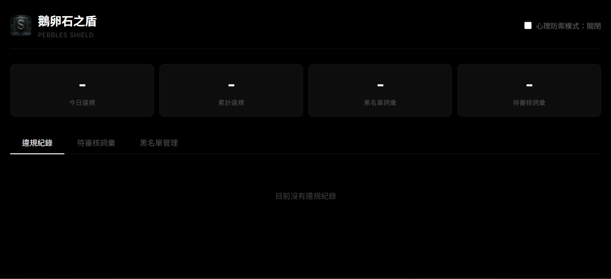
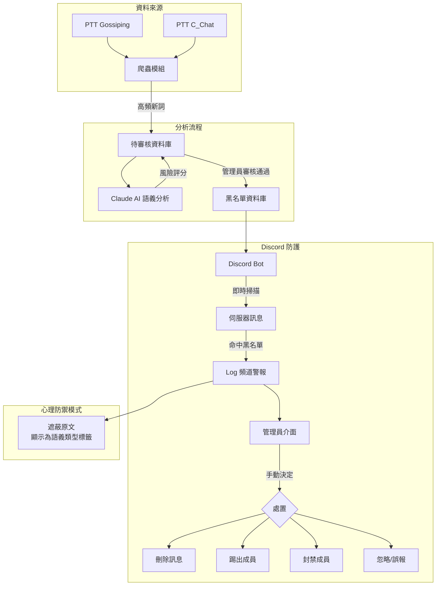
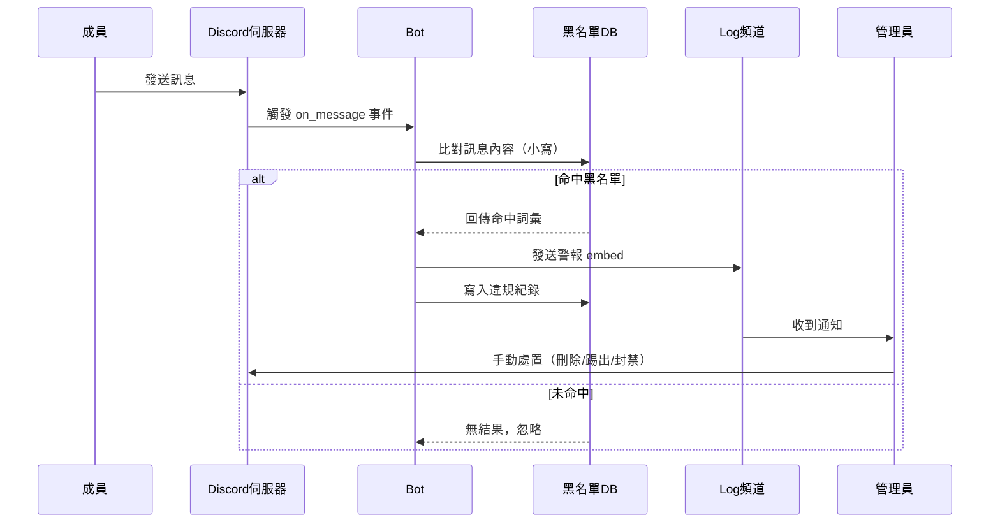
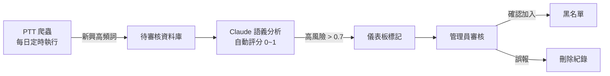

# 鵝卵石之盾 (Pebbles Shield)

> 自動化次文化趨勢監控與 Discord 社群防護系統



---

## 專案背景

本系統由 VTuber 社群「黑天鵝」的頻道管理員開發。網路次文化惡意隱語（如淫夢梗、歧視性諧音詞）演變速度極快，傳統靜態黑名單已不足以應對。本系統整合**自動化爬蟲**、**AI 語義分析**與**管理儀表板**，能主動追蹤新興黑話並即時應用於 Discord 訊息監控。

---

## 核心功能

| 功能 | 說明 |
|------|------|
| 多平台趨勢爬蟲 | 定時爬取 PTT（Gossiping、C_Chat）熱門討論，統計高頻新詞 |
| AI 語義分析 | 串接 Claude API，對新詞自動評估風險分數（0～1） |
| Discord 即時監控 | Bot 掃描伺服器訊息，命中黑名單即時警報 |
| 管理儀表板 | React 介面，支援審核、黑名單管理、一鍵處置 |
| 心理防禦模式 | 遮蔽違規原文，改顯示語義標籤，保護管理員心理健康 |

---

## 系統架構



### 訊息處理流程



### 黑名單更新流程



---

## 開發架構

本系統分四個模組逐步建構，每個模組獨立可運作：

| 步驟 | 模組 | 說明 |
|------|------|------|
| Step 1 | Discord Bot | 建立基礎監控架構，即時比對黑名單並發送警報 |
| Step 2 | PTT 爬蟲 | 定時爬取 PTT 熱門討論，統計關鍵字頻率，存入待審核資料庫 |
| Step 3 | Claude 語義分析 | 串接 AI API，對爬蟲抓到的新詞自動評分，連結 Discord 監控 |
| Step 4 | React 儀表板 | 提供趨勢管理、違規紀錄、心理防禦過濾等管理介面 |

---

## 檔案結構

```
Pebbles Shield/
│
├── .env                        # 環境變數（Token、API Key，不進 Git）
├── .env.example                # 環境變數範本
├── .gitignore                  # Git 忽略規則
├── requirements.txt            # Python 套件清單
│
├── bot/
│   └── discord_bot.py          # Discord Bot 主程式，監聽訊息並比對黑名單
│
├── scraper/
│   └── ptt_scraper.py          # PTT 爬蟲，抓取 Gossiping / C_Chat 高頻詞彙
│
├── analyzer/
│   └── ai_analyzer.py          # Claude API 語義分析，對待審核詞彙評分
│
├── api/
│   └── main.py                 # FastAPI 後端，提供 REST API 給儀表板
│
├── db/
│   ├── database.py             # SQLite 資料庫操作（黑名單、待審核、違規紀錄）
│   └── pebbles.db              # SQLite 資料庫檔案（自動產生，不進 Git）
│
├── dashboard/                  # React 管理儀表板（Vite）
│   ├── src/
│   │   ├── App.jsx             # 主頁面，包含 Header、Tab 切換、心理防禦開關
│   │   ├── App.css             # 全域樣式（黑色系主題）
│   │   ├── index.css           # 字體設定（Inter + Noto Sans TC）
│   │   ├── api.js              # 封裝所有對 FastAPI 後端的請求
│   │   └── components/
│   │       ├── Stats.jsx       # 頂部統計卡（今日違規、累計、黑名單數、待審核數）
│   │       ├── Violations.jsx  # 違規紀錄表格，支援心理防禦模式遮蔽
│   │       ├── Pending.jsx     # 待審核詞彙，一鍵加入黑名單或標記誤報
│   │       └── Blacklist.jsx   # 黑名單管理，支援新增與刪除
│   └── public/
│       └── logo.png            # 系統 Logo
│
├── system_overview.md          # 系統流程圖（給伺服器管理員參考）
├── letter_to_admin.md          # 邀請 Bot 進伺服器的說明信
└── README.md                   # 本文件
```

---

## 環境設定

### 1. 安裝 Python 套件

```bash
pip install -r requirements.txt
```

### 2. 設定環境變數

複製 `.env.example` 為 `.env`，填入以下資訊：

```env
DISCORD_TOKEN=你的_Discord_Bot_Token
ANTHROPIC_API_KEY=你的_Anthropic_API_Key
DISCORD_GUILD_ID=你的_伺服器_ID
LOG_CHANNEL_ID=記錄頻道_ID
```

### 3. 初始化資料庫

```bash
python -m db.database
```

---

## 啟動方式

### 啟動 Discord Bot

```bash
python -m bot.discord_bot
```

### 執行 PTT 爬蟲

```bash
python -m scraper.ptt_scraper
```

### 執行 AI 語義分析

```bash
python -m analyzer.ai_analyzer
```

### 啟動 API 後端

```bash
python -m api.main
```

API 文件：`http://localhost:8000/docs`

### 啟動管理儀表板

```bash
cd dashboard
npm install
npm run dev
```

儀表板：`http://localhost:5173`

---

## 資料庫結構

| 資料表 | 說明 |
|--------|------|
| `blacklist` | 已確認的惡意詞彙黑名單 |
| `pending_words` | 爬蟲抓到的待審核詞彙，含 AI 風險評分 |
| `violations` | Discord 違規訊息紀錄 |

---

## 技術棧

| 層級 | 技術 |
|------|------|
| Discord Bot | Python、discord.py |
| 爬蟲 | requests、BeautifulSoup4 |
| AI 分析 | Anthropic Claude API（claude-haiku-4-5） |
| 後端 API | FastAPI、uvicorn |
| 資料庫 | SQLite |
| 儀表板 | React、Vite、axios |

---

## 注意事項

- `.env` 檔案含有敏感資訊，**絕對不可上傳至公開 Git 儲存庫**
- `ai_analyzer.py` 已內建自動等待重試機制
- 所有管理操作（刪除訊息、踢出、封禁）均需在儀表板**手動確認**，Bot 不會自動懲處任何人
