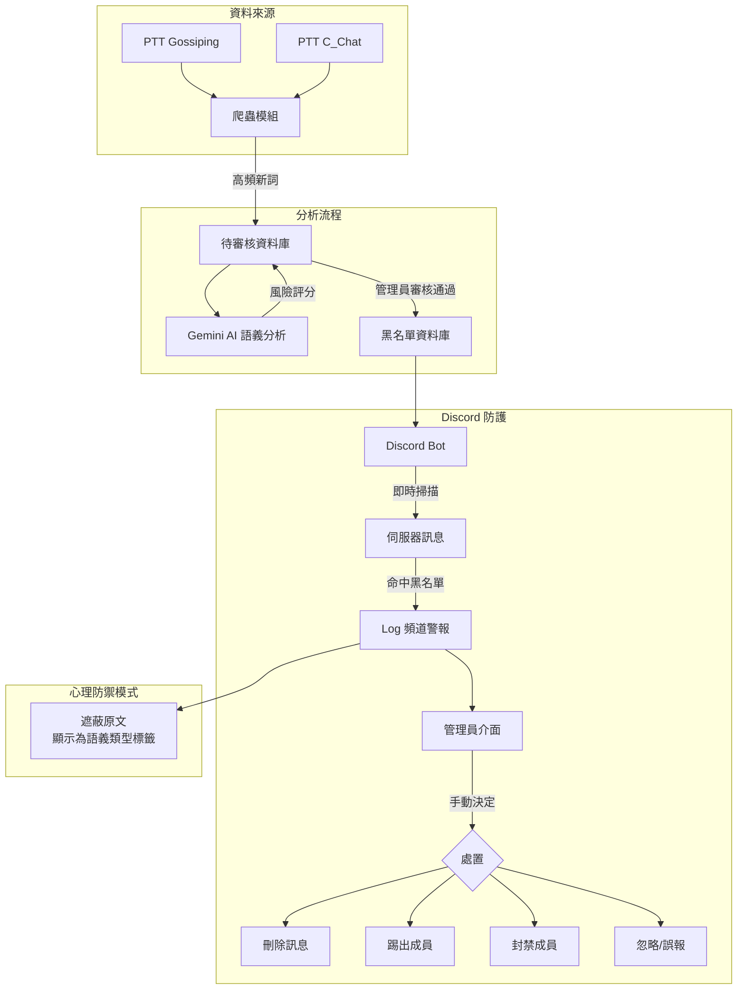
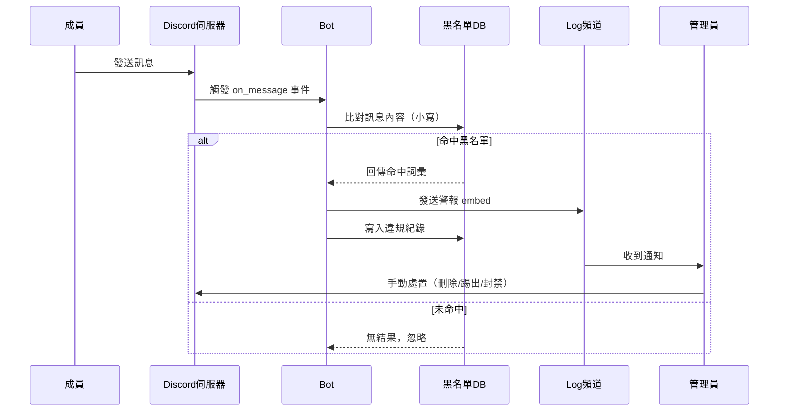
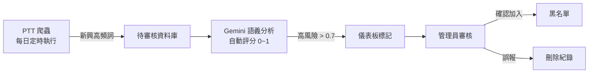

# 鵝卵石之盾 — 系統流程說明

## 系統架構圖

```mermaid
flowchart TD
    subgraph 資料來源
        A[PTT Gossiping] --> S[爬蟲模組]
        B[PTT C_Chat] --> S
    end

    subgraph 分析流程
        S --> |高頻新詞| P[待審核資料庫]
        P --> G[Gemini AI 語義分析]
        G --> |風險評分| P
        P --> |管理員審核通過| BL[黑名單資料庫]
    end

    subgraph Discord 防護
        BL --> BOT[Discord Bot]
        BOT --> |即時掃描| MSG[伺服器訊息]
        MSG --> |命中黑名單| LOG[Log 頻道警報]
        LOG --> ADMIN[管理員介面]
        ADMIN --> |手動決定| ACT{處置}
        ACT --> DEL[刪除訊息]
        ACT --> KICK[踢出成員]
        ACT --> BAN[封禁成員]
        ACT --> IGN[忽略/誤報]
    end

    subgraph 心理防禦模式
        LOG --> MASK[遮蔽原文\n顯示為語義類型標籤]
    end
```

## 訊息處理流程

```mermaid
sequenceDiagram
    participant 成員
    participant Discord伺服器
    participant Bot
    participant 黑名單DB
    participant Log頻道
    participant 管理員

    成員->>Discord伺服器: 發送訊息
    Discord伺服器->>Bot: 觸發 on_message 事件
    Bot->>黑名單DB: 比對訊息內容（小寫）
    alt 命中黑名單
        黑名單DB-->>Bot: 回傳命中詞彙
        Bot->>Log頻道: 發送警報 embed
        Bot->>黑名單DB: 寫入違規紀錄
        Log頻道->>管理員: 收到通知
        管理員->>Discord伺服器: 手動處置（刪除/踢出/封禁）
    else 未命中
        黑名單DB-->>Bot: 無結果，忽略
    end
```

## 黑名單更新流程

```mermaid
flowchart LR
    PTT[PTT 爬蟲\n每日定時執行] --> |新興高頻詞| PENDING[待審核資料庫]
    PENDING --> AI[Gemini 語義分析\n自動評分 0~1]
    AI --> |高風險 > 0.7| ALERT[儀表板標記]
    ALERT --> ADMIN[管理員審核]
    ADMIN --> |確認加入| BL[黑名單]
    ADMIN --> |誤報| DEL2[刪除紀錄]
```
